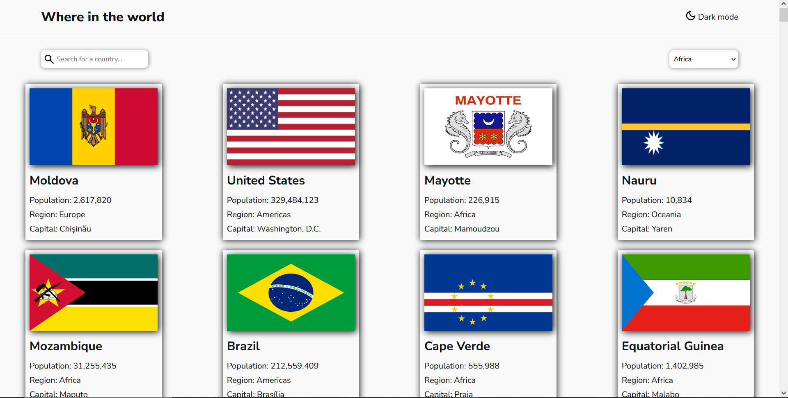

# Frontend Mentor - REST Countries API with color theme switcher solution

Task given by Kodecamp

This is a solution to the [REST Countries API with color theme switcher challenge on Frontend Mentor](https://www.frontendmentor.io/challenges/rest-countries-api-with-color-theme-switcher-5cacc469fec04111f7b848ca). Frontend Mentor challenges help you improve your coding skills by building realistic projects. 

## Table of contents

  - [The challenge](#the-challenge)
  - [Screenshot](#screenshot)
  - [Links](#links)
  - [Built with](#built-with)
- [Author](#author)
- [Acknowledgments](#acknowledgments)

### The challenge

Users should be able to:

- See all countries from the API on the homepage
- Search for a country using an `input` field
- Filter countries by region
- Click on a country to see more detailed information
- Toggle the color scheme between light and dark mode 

### Screenshot

### Links

- Solution URL: [Github](https://github.com/A-Siddeeq/kodecamp-countries-list-task)
- Live Site URL: [Vercel](https://kodecamp-countries-list-task.vercel.app/)

### Built with

- Semantic HTML5 markup
- CSS custom properties
- Flexbox
- CSS Grid
- Mobile-first workflow

## Author

- Frontend Mentor - [@A-Siddeeq](https://www.frontendmentor.io/profile/A-Siddeeq)

## Acknowledgments

FrontendMentor, Kodecamp
